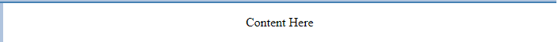

# Documentation for Hugh Jay's CST3106 Student Portfolio
___
### Colour Palette
- Background (light) `#FFFFFF` (White)
- Background (dark) `#373545` (Indigo)
- H1-H4 Text (light) `#2f4f4f` (dark slate)
- H5 Text `#008b8b` (dark cyan)
- Text - `#000000` (black)
- Header background `#4642b4` (steel blue)
- Menus / sidebar `#b0c4de` (light steel blue)
- Lines / demarcation `#5f9ea0` (cadet blue)
- Links (unvisited) `#000000` (black)
- Links (visited / hover) `#008b8b` (dark cyan)

### Font
- Headers - `"Helvetica", sans serif` 
- Body - `"Helvetica", sans serif`

### Header
- Design: Light steel blue background with left justified text. Demarcation line spanning the length of the display with a 2% margin on either side
- **Mock-up Screenshot:**

### Navigation Menu
- Design: Hamburger-stack expanding menu. Left-justified text. Light steel blue background with cadet blue border. Black links with no underline. Expand across bottom of header on desktop, expand down on mobile.
- **Mock-up Screenshot: (see above)**
![Navbar (within header) Mock-up]

### Sidebar
- Design: Light steel blue background.
- **Mock-up Screenshot:**

### Content
- Centered black text on white background.
- **Mock-up Screenshot:**

### Footer
- Dark slate background with white text and links. No underlines.
- **Mock-up Screenshot:**

### Layout
- Flex layout with automatic adjustment to smaller screens.
- Header, sidebar, and footer staying constant with only the Content (articles) changing through navigation.
